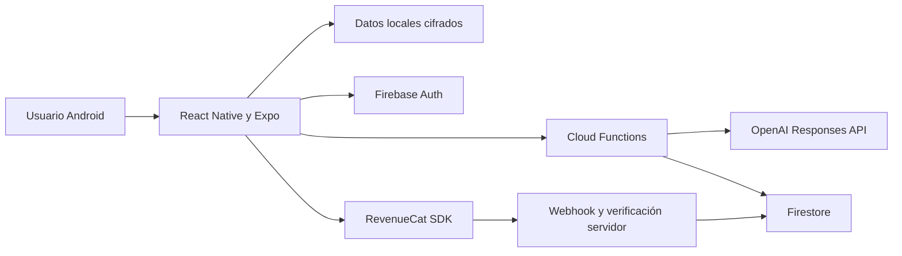
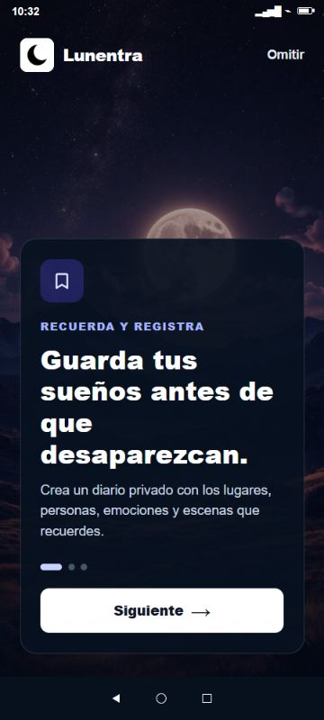

# Lunentra


Aplicación Android de diario de sueños con interpretaciones asistidas por IA, diseñada para conservar la privacidad del contenido personal y ofrecer continuidad entre sesiones.

## Estado actual

- Aplicación funcional en dispositivo Android real.
- Interpretaciones de OpenAI y persistencia verificadas.
- Compra de prueba de RevenueCat completada correctamente.
- Doce testers reclutados para la prueba cerrada de Google Play.
- Pendiente de subir el AAB actualizado e iniciar formalmente la prueba cerrada.

No está publicada todavía como versión de producción.

## Funcionalidades principales

- Registro de sueños y consulta del historial.
- Interpretación, resumen, emociones y patrones profundos mediante OpenAI.
- Uso inicial como invitado y migración posterior a una cuenta.
- Arquitectura local-first para mantener la experiencia disponible y rápida.
- Cifrado local XChaCha20-Poly1305 y almacenamiento seguro de claves.
- Sincronización con Firebase y controles de cuota en servidor.
- Suscripciones y verificación de compras mediante RevenueCat.
- Notificaciones, analítica, rendimiento y reporte de fallos sujetos a consentimiento.
- Eliminación de cuenta y datos asociados.

## Arquitectura



Las claves privadas y las llamadas privilegiadas permanecen en servidor. La aplicación reserva cuota antes de una interpretación y la compensa si el proveedor externo falla.

## Tecnologías

| Área | Tecnologías |
| --- | --- |
| Aplicación | React Native 0.81, Expo 54, React 19, JavaScript |
| Backend | Firebase Auth, Firestore, Cloud Functions, App Check |
| IA | OpenAI Responses API |
| Privacidad local | AsyncStorage, SecureStore, XChaCha20-Poly1305 |
| Suscripciones | RevenueCat y Google Play Billing |
| Observabilidad | Analytics, Crashlytics y Performance con consentimiento |
| Entrega | EAS Build, Android App Bundle y Google Play Console |

## Desarrollo local

```bash
npm install
npm run start
```

Para ejecutar la aplicación con todas sus funciones se necesitan proyectos propios de Firebase, OpenAI y RevenueCat. Copia `.env.example` a un archivo local y no incluyas secretos en el repositorio.

## Privacidad y límites

- El diario contiene información personal sensible y se protege localmente mediante cifrado autenticado.
- Los secretos de OpenAI y la verificación de compras se mantienen en backend.
- La aplicación ofrece interpretación y reflexión personal; no realiza diagnóstico clínico ni sustituye atención profesional.
- La telemetría opcional se activa únicamente después del consentimiento.

## Recursos visuales

<p align="center">
  
</p>

## Autoría

Producto ideado, diseñado y desarrollado íntegramente por **Haydar Cano Morales** mediante un flujo de ingeniería asistida por ChatGPT y Codex.


